# Лабораторная работа №1. HA Postgres Cluster

## Выполнили: 
- Архангельская Елизавета Павловна, K3339
- Данилова Анастасия Алексеевна, K3339
- Шукалов Андрей Денисович, K3339

## Задача
Развернуть и настроить высокодоступный кластер Postgres

### Часть 1. Поднимаем Postgres

`Dockerfile`
```dockerfile
FROM postgres:15

RUN echo "en_US.UTF-8 UTF-8" > /etc/locale.gen && \
    locale-gen en_US.UTF-8

ENV LANG=en_US.UTF-8
ENV LANGUAGE=en_US:en
ENV LC_ALL=en_US.UTF-8

RUN apt-get update -y && \
    apt-get install -y netcat-openbsd python3-pip curl python3-psycopg2 python3-venv iputils-ping

RUN python3 -m venv /opt/patroni-venv && \
    /opt/patroni-venv/bin/pip install --upgrade pip && \
    /opt/patroni-venv/bin/pip install patroni[zookeeper] psycopg2-binary

RUN mkdir -p /var/lib/postgresql/wal_archive && \
    chown -R postgres:postgres /var/lib/postgresql/wal_archive && \
    chmod 700 /var/lib/postgresql/wal_archive

COPY postgres0.yml /postgres0.yml
COPY postgres1.yml /postgres1.yml

ENV PATH="/opt/patroni-venv/bin:$PATH"

USER postgres
```

`docker-compose.yml`
```yaml
services:
  pg-master:
    build: .
    image: localhost/postgres:patroni
    container_name: pg-master
    restart: always
    hostname: pg-master
    environment:
      POSTGRES_USER: postgres
      POSTGRES_PASSWORD: postgres
      PGDATA: '/var/lib/postgresql/data/pgdata'
    expose:
      - 8008
    ports:
      - 5433:5432
    volumes:
      - pg-master:/var/lib/postgresql/data
      - pg-wal-archive:/var/lib/postgresql/wal_archive 
    command: patroni /postgres0.yml

  pg-slave:
    build: .
    image: localhost/postgres:patroni
    container_name: pg-slave
    restart: always
    hostname: pg-slave
    expose:
      - 8008
    ports:
      - 5434:5432
    volumes:
      - pg-slave:/var/lib/postgresql/data
      - pg-wal-archive:/var/lib/postgresql/wal_archive
    environment:
      POSTGRES_USER: postgres
      POSTGRES_PASSWORD: postgres
      PGDATA: '/var/lib/postgresql/data/pgdata'
    command: patroni /postgres1.yml

  zoo:
    image: confluentinc/cp-zookeeper:7.7.1
    container_name: zoo
    restart: always
    hostname: zoo
    ports:
      - 2181:2181
    environment:
      ZOOKEEPER_CLIENT_PORT: 2181
      ZOOKEEPER_TICK_TIME: 2000

volumes:
  pg-master:
  pg-slave:
  pg-wal-archive:
```

`postgres0.yml`
```yaml
scope: my_cluster
name: postgresql0

restapi:
  listen: pg-master:8008
  connect_address: pg-master:8008

zookeeper:
  hosts:
    - zoo:2181

bootstrap:
  dcs:
    ttl: 30
    loop_wait: 10
    retry_timeout: 10
    maximum_lag_on_failover: 10485760
    synchronous_mode: true
    postgresql:
      use_pg_rewind: true
      use_slots: true
      parameters:
        wal_level: replica
        hot_standby: "on"
        wal_keep_segments: 32
        max_wal_senders: 10
        max_replication_slots: 10
        archive_mode: "on"
        archive_command: 'test ! -f /var/lib/postgresql/wal_archive/%f && cp %p /var/lib/postgresql/wal_archive/%f'
        archive_timeout: 60
  pg_hba:
  - host replication replicator 0.0.0.0/0 md5
  - host all all 0.0.0.0/0 md5

postgresql:
  listen: 0.0.0.0:5432
  connect_address: pg-master:5432
  data_dir: /var/lib/postgresql/data/postgresql0
  bin_dir: /usr/lib/postgresql/15/bin
  pgpass: /tmp/pgpass0
  remove_data_directory_on_rewind_failure: true
  authentication:
    replication:
      username: replicator
      password: replicator
    superuser:
      username: postgres
      password: postgres
  parameters:
    unix_socket_directories: '.'
    wal_keep_segments: 64
    max_wal_size: 1GB

recovery_conf:
  restore_command: 'cp /var/lib/postgresql/wal_archive/%f %p'

watchdog:
  mode: off

tags:
  nofailover: false
  noloadbalance: false
  clonefrom: false
  nosync: false
```

`postgres1.yml` делаем на основе `postgres0.yml`, нужно заменить только: 
- `pg-master` на `pg-replica` 
- `postgresql0` на `postgresql1` (в `name` и `data_dir`)
- `pgpass: /tmp/pgpass0` на `pgpass: /tmp/pgpass1`

Деплоим командой `docker compose up -d`
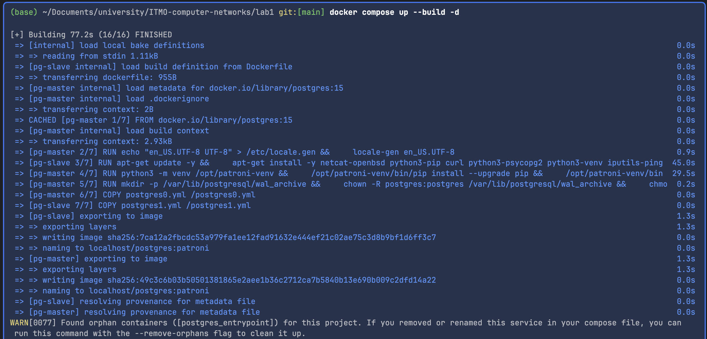
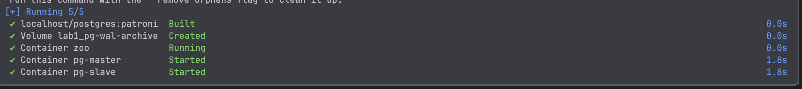

Все успешно запустилось. 

Теперь ищем ноду, которая стала лидером. У нас это pg-slave


Zookeeper работает. 
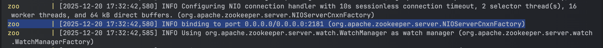

**Вопросы**
1. Порты 8008 и 5432 вынесены в разные директивы, expose и ports. По сути, если записать 8008 в ports, то он тоже станет exposed. В
чем разница?
    - `expose` - порт виден только контейнерам внутри docker-сети
    - `ports` - порт публикуется на хост и автоматически доступен внутри сети
    - получается, что `ports` это `expose` + доступ снаружи.
2. При обычном перезапуске композ-проекта, будет ли сбилден заново образ? А если предварительно отредактировать файлы postgresX.yml? А если содержимое самого Dockerfile? Почему?
    - при перезапуске с помощью `docker compose up -d` образ не пересобирается, тк берется существующий образ из кэша. контейнеры просто перезапускаются 
    - `postgresX.yml` не влияет на сборку образа, тк это runtime-конфигурация(при запуске контейнера). при изменении `postgresX.yml` `docker compose up -d` не пересоберет образ, а контейнеры будут созданы заново с использованием новых `postgresX.yml`
    - при изменении `Dockerfile` сбрасывается кеш сборки, поэтому будет создан новый образ 


### Часть 2. Проверяем репликацию 

Подключаемся к обеим нодам postgres. Тк у нас главная `pg-slave`, то указываем у нее `localhost:5433`, у второй указываем `localhost:5434`

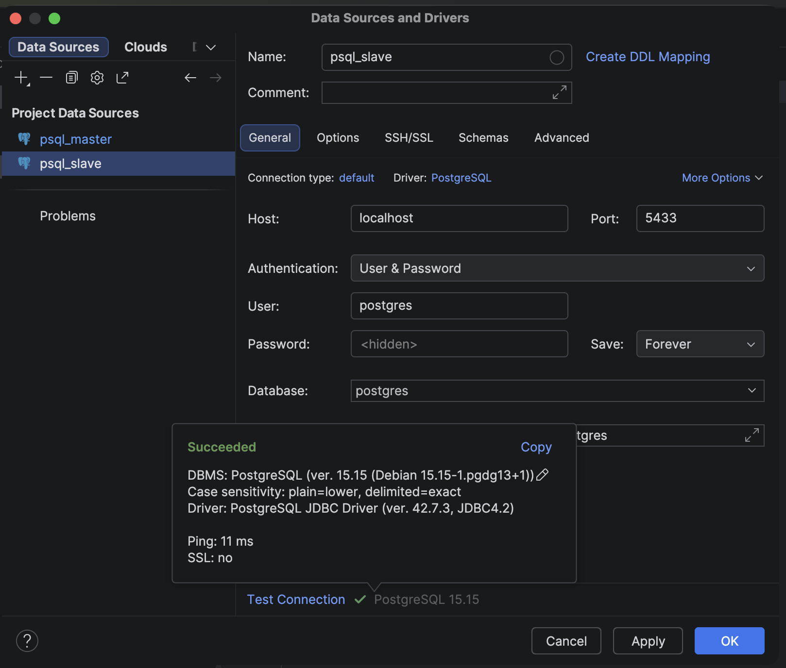
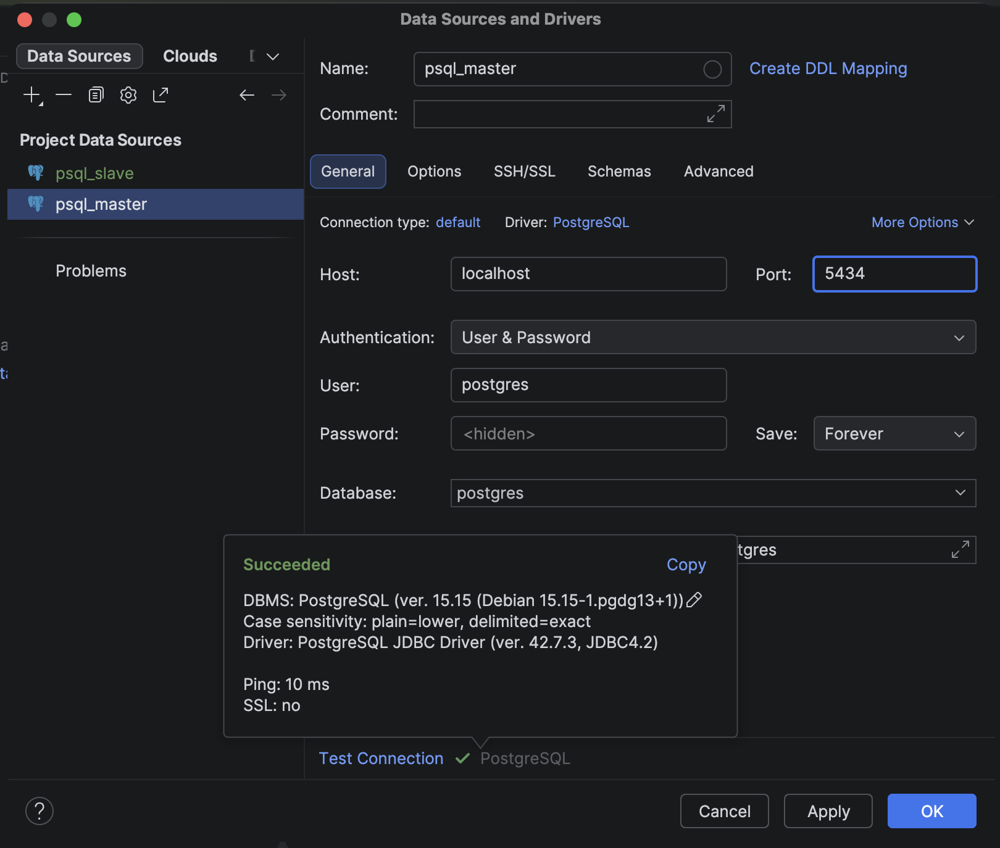

Создаем таблицу и записываем данные в ноду `pg-slave`: 

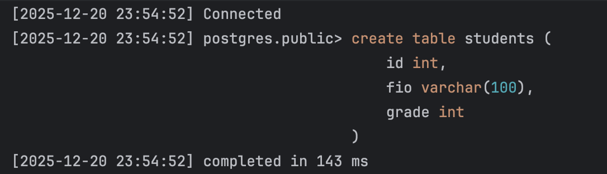
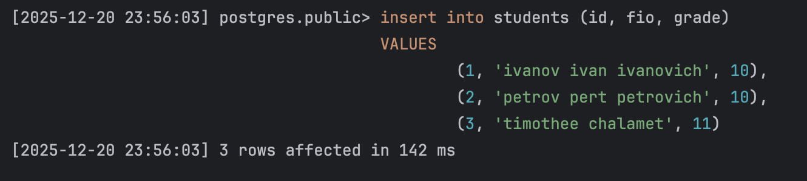

Убедимся, что в `pg-master` данные тоже добавились:

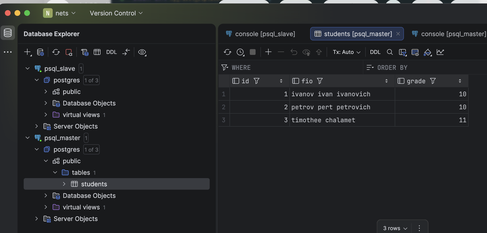

Так же убедимся, что `pg-master` доступна только для чтения, но не редактирования: 


### Часть 3. Делаем высокую доступность

Добавляем в `docker-compose.yml` и создаем `haproxy.cfg` 

`docker-compose.yml`
```yaml
haproxy:
  image: haproxy:3.0
  container_name: postgres_entrypoint
  ports:
    - 5435:5432
    - 7007:7007
  depends_on:
    - pg-master
    - pg-slave
    - zoo
  volumes:
    - ./haproxy.cfg:/usr/local/etc/haproxy/haproxy.cfg
```

`haproxy.cfg`
```cfg
global
    maxconn 100

defaults
    log global
    mode tcp
    retries 3
    timeout client 30m
    timeout connect 4s
    timeout server 30m
    timeout check 5s

listen stats
    mode http
    bind *:7007
    stats enable
    stats uri /
    stats refresh 10s
    stats show-legends
    stats admin if TRUE

listen postgres
    bind *:5432
    option httpchk GET /patroni
    http-check expect status 200
    default-server inter 3s fall 3 rise 2 on-marked-down shutdown-sessions
    server postgresql_pg_master_5432 pg-master:5432 maxconn 100 check port 8008
    server postgresql_pg_slave_5432 pg-slave:5432 maxconn 100 check port 8008
```

Перезапускам проект и проверяем работу прокси. В этот раз `postgresql0` стала лидером. Zookeeper подключился успешно. 
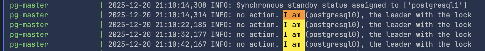
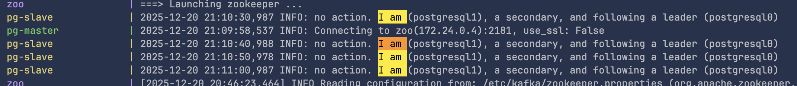
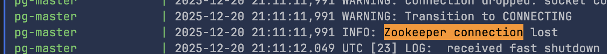

HAProxy так же успешно подключен: 
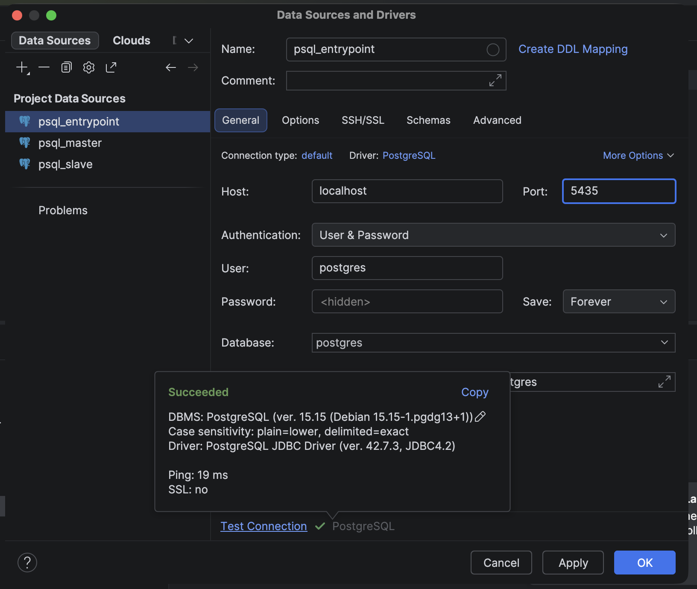

Теперь отключаем `postgresql0` (лидера). И видим, что `postgresql1` стала лидером.
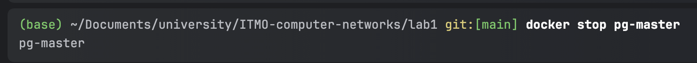
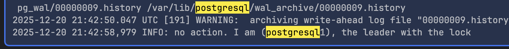

Теперь попробуем записать данные через `psql_entrypoint`. Проверяем, что данные, которые мы записывали до этого подтянулись 
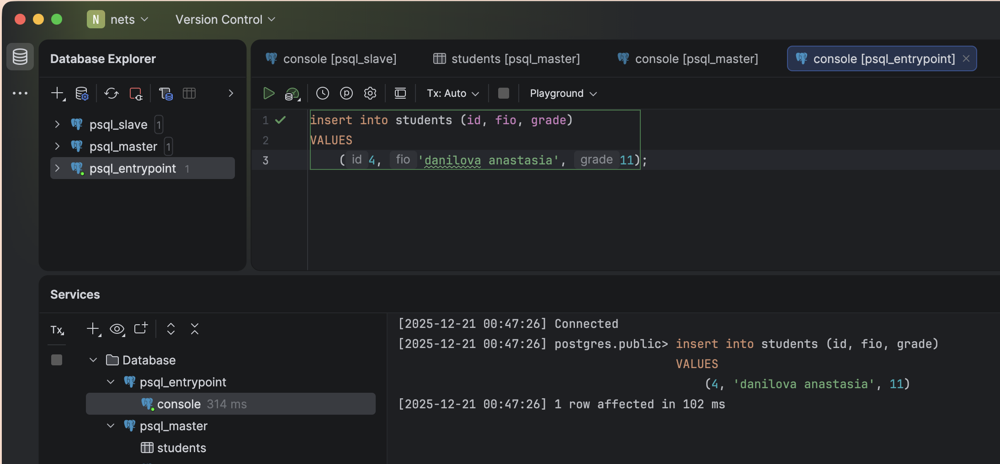
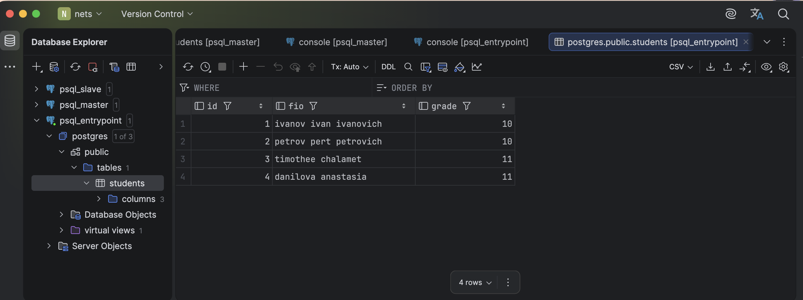


В `pg-slave` тоже появилась запись
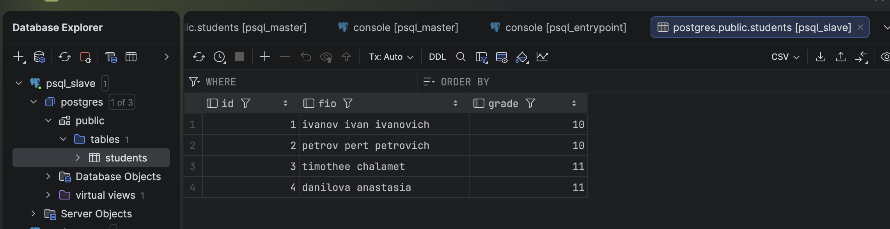

Теперь поднимем `pg-master` и убедимся, что запись тут тоже появится
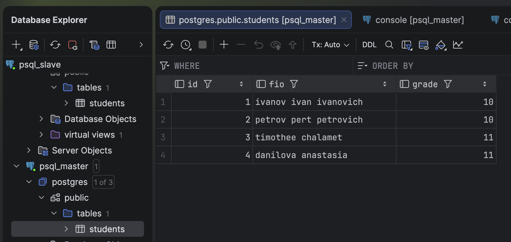

Что же произошло после принудительного отключения мастера? 
- Patroni на каждой ноде периодически проверяет доступность PostgreSQL и состояние лидера в zookeeper. 
- Когда мы остановили pg-master, он перестал обновлять свой leader lock в ZooKeeper и по истечении времени `ttl` запись была признана не действительной 
- Реплика `pg-slave` автоматически прошла процедуру выбора лидера и была повышена до нового master
- HAProxy с помощью Patroni API, обнаружил смену роли и начал направлять клиентские подключения на новую master-ноду(на `pg-slave` в нашем случае).

