# Лабораторная работа №2. Loki + Zabbix + Grafana

## Выполнили: 
- Архангельская Елизавета Павловна, K3339
- Данилова Анастасия Алексеевна, K3339
- Шукалов Андрей Денисович, K3339

## Задача
Развернуть и настроить Nextcloud, Loki, Promtail, Grafana, Zabbix.

### Часть 1. Логирование

Создаём файл docker-compose.yml, который содержит в себе тестовый сервис Nextcloud, Loki, Promtail, Grafana, Zabbix и Postgres для него

`docker-compose.yml`
```yaml
version: "3.9"

services:
  nextcloud:
    image: nextcloud:29.0.6
    container_name: nextcloud
    ports:
      - "8080:80"
    volumes:
      - nc-data:/var/www/html/data

  loki:
    image: grafana/loki:2.9.0
    container_name: loki
    ports:
      - "3100:3100"
    command: -config.file=/etc/loki/local-config.yaml

  promtail:
    image: grafana/promtail:2.9.0
    container_name: promtail
    volumes:
      - nc-data:/opt/nc_data
      - ./promtail_config.yml:/etc/promtail/config.yml
    command: -config.file=/etc/promtail/config.yml
    depends_on:
      - loki

  grafana:
    image: grafana/grafana:11.2.0
    container_name: grafana
    ports:
      - "3000:3000"
    environment:
      - GF_PATHS_PROVISIONING=/etc/grafana/provisioning
      - GF_AUTH_ANONYMOUS_ENABLED=true
      - GF_AUTH_ANONYMOUS_ORG_ROLE=Admin
    depends_on:
      - loki

  postgres-zabbix:
    image: postgres:15
    container_name: postgres-zabbix
    environment:
      POSTGRES_USER: zabbix
      POSTGRES_PASSWORD: zabbix
      POSTGRES_DB: zabbix
    volumes:
      - zabbix-db:/var/lib/postgresql/data
    healthcheck:
      test: ["CMD", "pg_isready", "-U", "zabbix"]
      interval: 10s
      retries: 5
      start_period: 5s

  zabbix-server:
    image: zabbix/zabbix-server-pgsql:ubuntu-6.4-latest
    container_name: zabbix-back
    ports:
      - "10051:10051"
    depends_on:
      - postgres-zabbix
    environment:
      POSTGRES_USER: zabbix
      POSTGRES_PASSWORD: zabbix
      POSTGRES_DB: zabbix
      DB_SERVER_HOST: postgres-zabbix

  zabbix-web-nginx-pgsql:
    image: zabbix/zabbix-web-nginx-pgsql:ubuntu-6.4-latest
    container_name: zabbix-front
    ports:
      - "8082:8080"
    depends_on:
      - postgres-zabbix
      - zabbix-server
    environment:
      POSTGRES_USER: zabbix
      POSTGRES_PASSWORD: zabbix
      POSTGRES_DB: zabbix
      DB_SERVER_HOST: postgres-zabbix
      ZBX_SERVER_HOST: zabbix-back

volumes:
  nc-data:
  zabbix-db:

```

Создаем файл `promtail_config.yml`:
```yaml
server:
  http_listen_port: 9080
  grpc_listen_port: 0

positions:
  filename: /tmp/positions.yaml

clients:
  - url: http://loki:3100/loki/api/v1/push

scrape_configs:
  - job_name: system
    static_configs:
      - targets:
          - localhost
        labels:
          job: nextcloud_logs
          __path__: /opt/nc_data/*.log

```
Запускаем `docker-compose up -d` и проверяем что все контейнеры запустились:
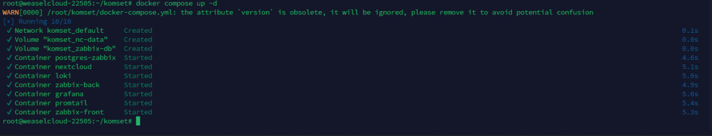

Заходим на `http://localhost:8080` и инициализируем Nextcloud:


Проверяем логи в `/var/www/html/data/nextcloud.log`:
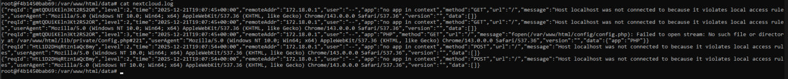

Теперь проверяем логи promtail и находим `"Seeked /opt/nc_data/nextcloud.log - ..."`
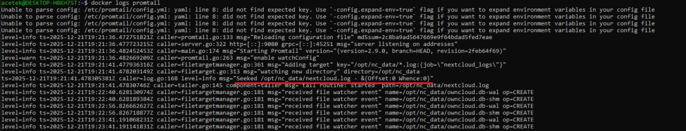

Всё запустилось отлично.

### Часть 2. Мониторинг
Настраиваем Zabbix. Заходим на `http://localhost:8082` по Admin:zabbix. 
Создаём `template.yml:`

```yaml
zabbix_export:
  version: '6.4'
  template_groups:
    - uuid: a571c0d144b14fd4a87a9d9b2aa9fcd6
      name: Templates/Applications
  templates:
    - uuid: a615dc391a474a9fb24bee9f0ae57e9e
      template: 'Test ping template'
      name: 'Test ping template'
      groups:
        - name: Templates/Applications
      items:
        - uuid: a987740f59d54b57a9201f2bc2dae8dc
          name: 'Nextcloud: ping service'
          type: HTTP_AGENT
          key: nextcloud.ping
          value_type: TEXT
          trends: '0'
          preprocessing:
            - type: JSONPATH
              parameters:
                - $.body.maintenance
            - type: STR_REPLACE
              parameters:
                - 'false'
                - healthy
            - type: STR_REPLACE
              parameters:
                - 'true'
                - unhealthy
          url: 'http://{HOST.HOST}/status.php'
          output_format: JSON
          triggers:
            - uuid: a904f3e66ca042a3a455bcf1c2fc5c8e
              expression: 'last(/Test ping template/nextcloud.ping)="unhealthy"'
              recovery_mode: RECOVERY_EXPRESSION
              recovery_expression: 'last(/Test ping template/nextcloud.ping)="healthy"'
              name: 'Nextcloud is in maintenance mode'
              priority: DISASTER
```
В `Data collection/Template` делаем import этого шаблона для мониторинга nextcloud.

Теперь для того, чтобы Zabbix и Nextcloud могли взаимодействовать внутри докера по коротким именам, выполняем в контейнере под юзером www-data команду: `php occ config:system:set trusted_domains 1 --value="nextcloud"`.

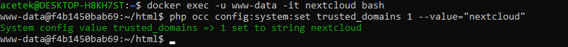

В `Monitoring/Latest data` увидим полученные данные:
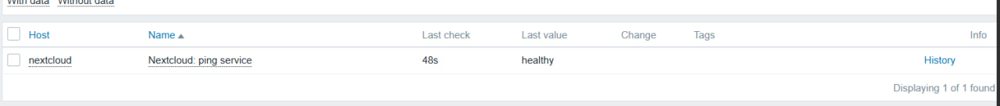

После настройки мониторинга проверим, что все работает: сначала выполним команду в контейнере: `php occ maintenance:mode --on` и получим ошибку:
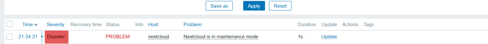

Выполнив обратную команду: `php occ maintenance:mode --off`:
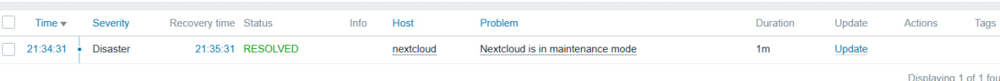

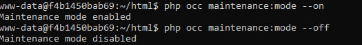


### Часть 3. Визуализация.

Выполняем команды: `docker exec -it grafana bash -c "grafana cli plugins install alexanderzobnin-zabbix-app"` и затем: `docker restart grafana`:
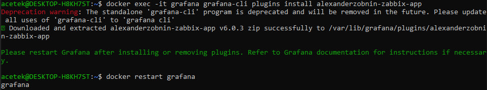

Заходим в Grafana по `http://localhost:3000/` и подключаем в `Plugins` Zabbix:
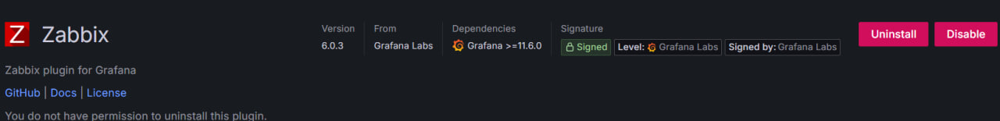

Следующим шагом подключем Loki к Grafana. Указываем адрес: `http://loki:3100`
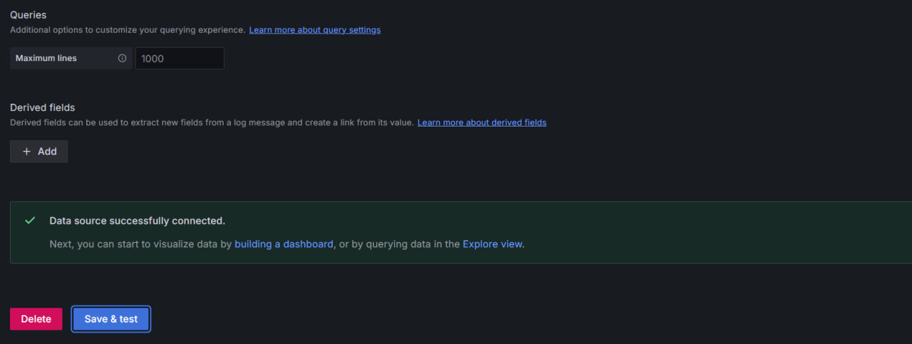

Аналогично подключем Zabbix, url: `http://zabbix-front:8080/api_jsonrpc.php`, username и password берём от zabbix:


Теперь в `Explore` смотрим логи от zabbix:
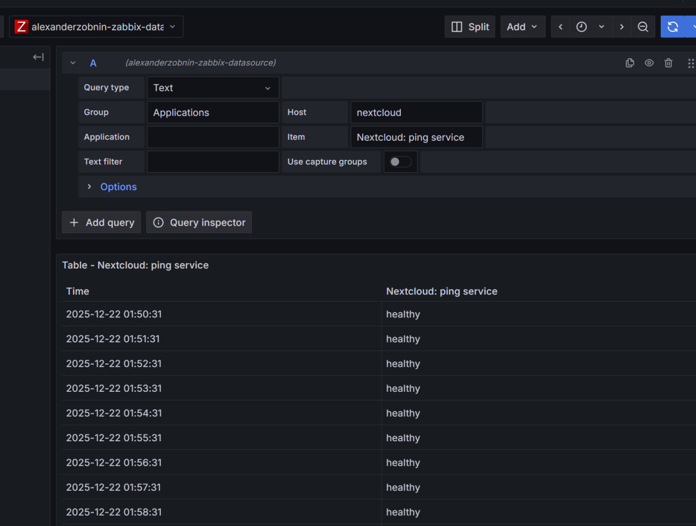

Для получения логов от Loki пришлось явно прописывать в контейнере уровень логов:
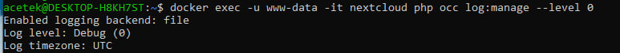

И сами логи от Loki:
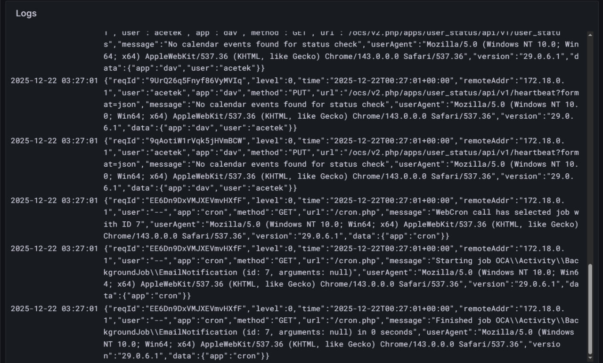

### Часть 4. Различные запросы.
Один интересный запросов --- получение метрики по caсhe попаданиям.
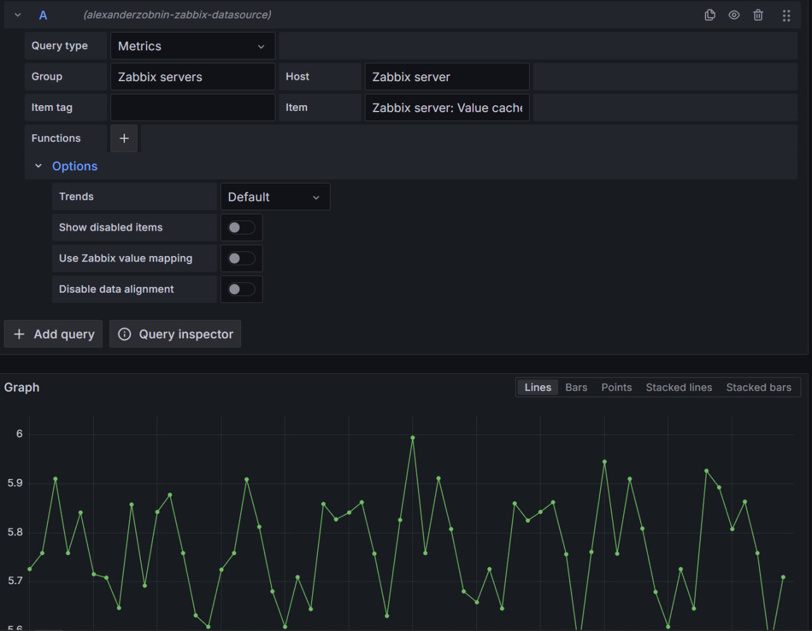

Запрос на получение состояния сервиса.
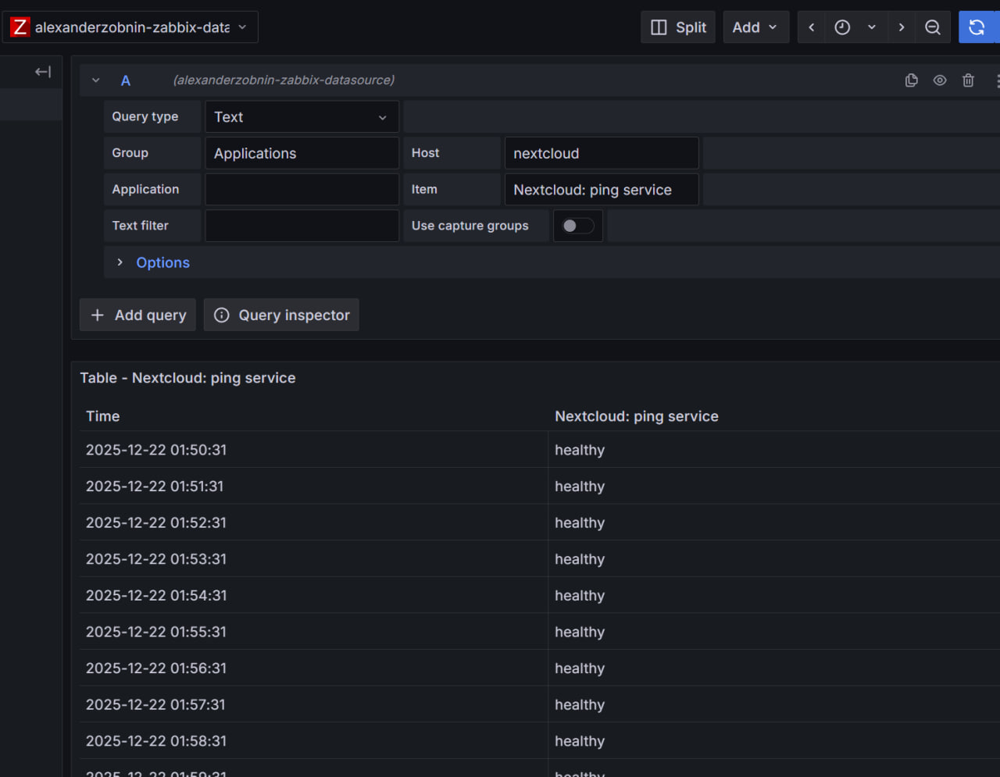

### Часть 5. Создание дашбордов.
Создаём дашборд с использованием Zabbix для отображения состояния сервиса. В Query указываем Group -- Applications, Host -- nextcloud, Item -- ping service. Также добавляем Value Mappings, чтобы красным было состояние когда сервис unhealthy, а зелёным -- healthy.

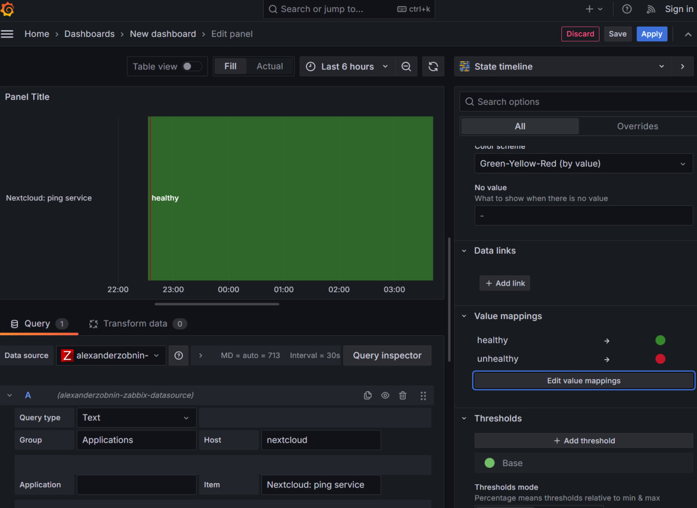

Второй дашборд с использованием Loki для отображения логов. В query выставляем запрос на получение логов, запускаем Run query. Можно добавить также парсинг json или форматированние таблицы.

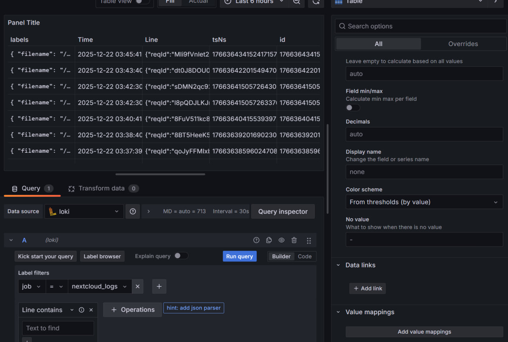

### Часть 6. Ответы на вопросы.

#### 1. Чем SLO отличается от SLA?
SLA -- Service Level Agreement. То есть это соглашение / договор между тем, кто предоставляет сервис и клиентом. В нём могут быть указаны ответственности сторон, штрафы, время реакции на инциденты и прочее.

SLO --- Service Level Objective. Это техническая цель команды, которой стараются придерживаться. В ней могут быть указаны целевые значения метрик.

#### 2. Чем отличается инкрементальный бэкап от дифференциального?
Инкрементальный бэкап -- сохраняет изменения с последнего бэкапа, а значит он быстрый, занимает меньше места. Но, чтобы использовать его при восстановлении нужен последний полный бэкап и все инкрементальные после него, следовательно, повреждение одного инкрементального бэкапа может сломать всё восстановление. 

Дифференциальный бэкап -- сохраняет все изменения с момента последнего полного бэкапа. Медленее, чем инкрементальный и больше весит. Зато при восстановлении нужен только один полный бэкап и один дифференциальный.

#### 3. В чем разница между мониторингом и observability?

Мониторинг нужен для того, чтобы отслеживать работает ли сервис нормально в данный момент и отслеживать уже известные проблемы. В нём используются заранее определённые метрики, счётчики, алерты. 

Obserbability -- позволяет понять, что происходит внутри системы и выявлять проблемы, которые не были известны ранее. Для этого собираются разные метрики, логи, трейсы, изучается корреляция данных.
