# Лабораторная работа №3. Ansible + Caddy

## Выполнили:

- Архангельская Елизавета Павловна, K3339
- Данилова Анастасия Алексеевна, K3339
- Шукалов Андрей Денисович, K3339

## Задача

На целевом сервере установить Ansible и вебсервер Caddy

### Часть 1. Установка и настройка Ansible

Работа проводилась на виртуальной машине Ubuntu 24.04 (VirtualBox, NAT).

Устанавливаем пакетный менеджер pip для python и настраиваем виртуальное окружение:

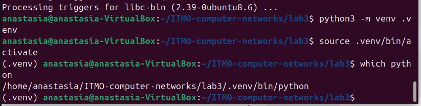

Далее устанавливаем сам ansible:

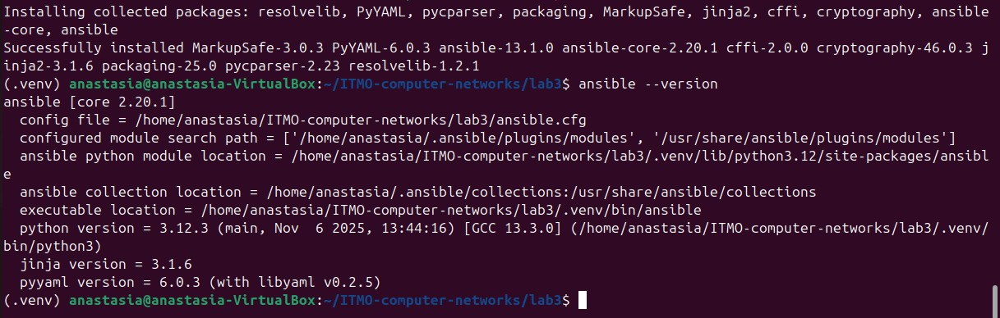

Создаем базовый конфиг файл и файл с хостами в папке inventory:

ansible.cfg

```
[defaults]
host_key_checking = false
inventory = inventory/hosts
```

inventory/hosts

```
[my_servers]
local_server ansible_host=localhost ansible_connection=local
```

Проверяем подключение Ansible к клиенту:
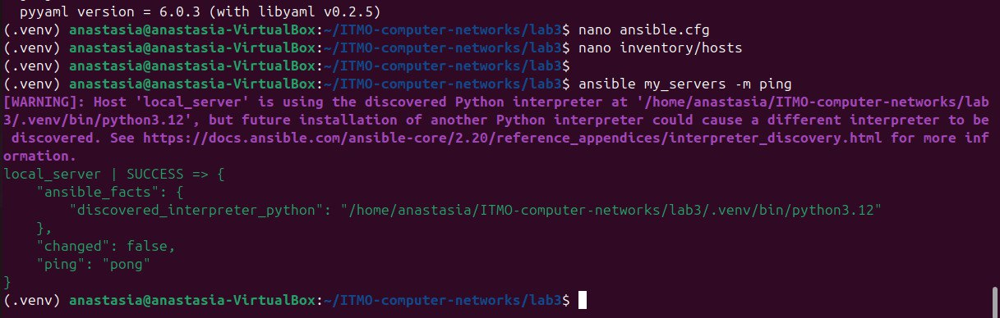
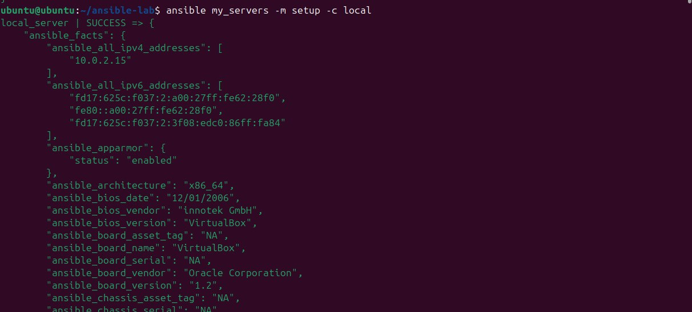

**Пробуем выполнить команду на сервере:**

Создаем на сервере файл test.txt и удаляем его:

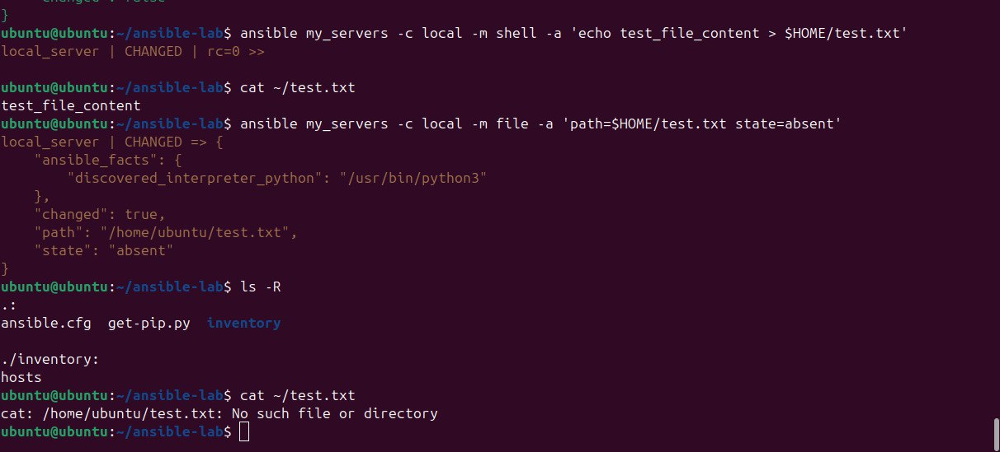

### Часть 2. Установка Caddy

Создадим папку roles и в ней инициализируем исходное конфигурационное “дерево”: ansible-galaxy init caddy_deploy

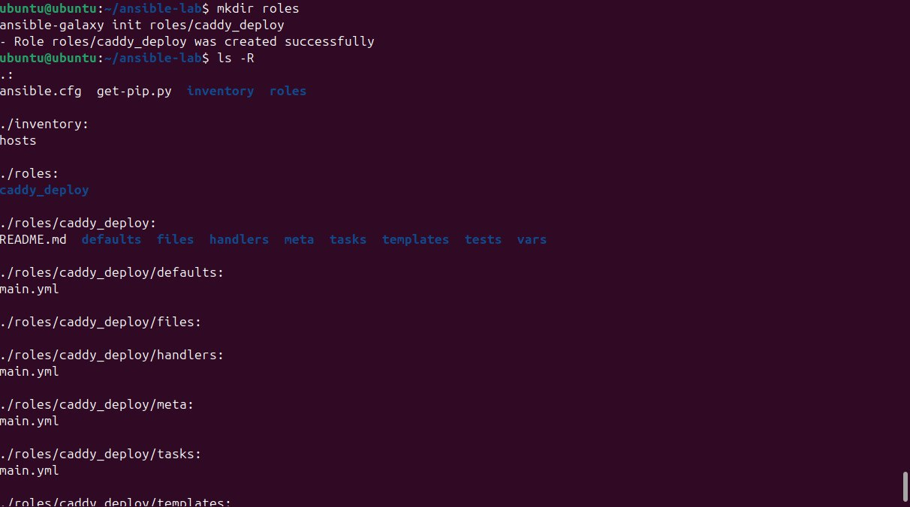

Наполняем файл roles/caddy_deploy/tasks/main.yml:

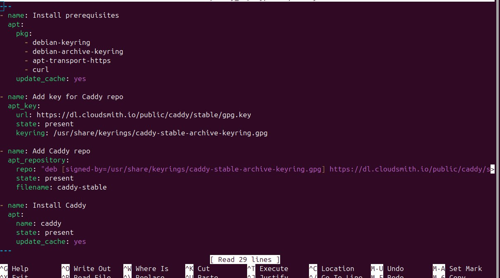

Далее создаем файл конфигурации самого плейбука caddy_deploy.yml:

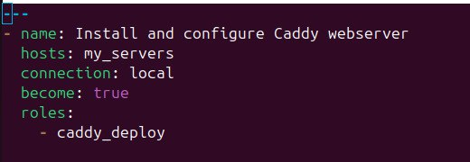

Далее запускаем плейбук ansible-playbook caddy_deploy.yml:

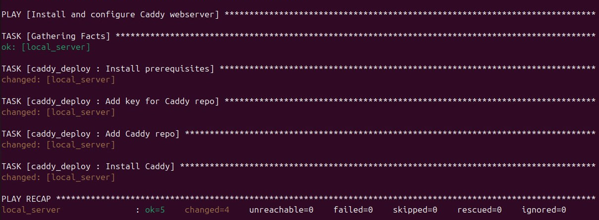

Все работает.

### Часть 3. Домен и настройка Caddyfile

На платформе duckdns.org был зарегистрирован домен:
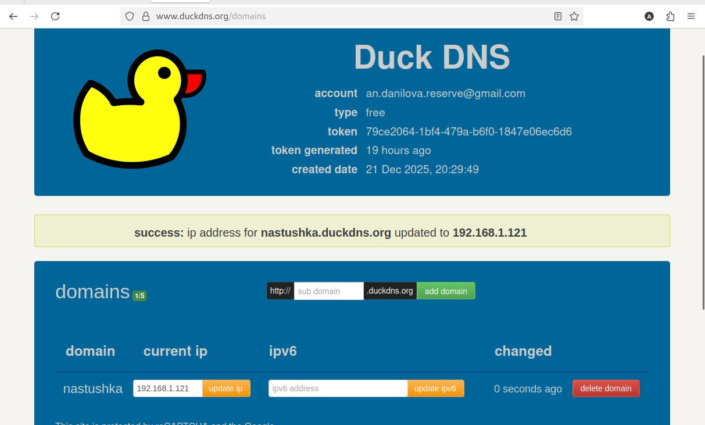

Был настроен CaddyFile

```
GNU nano 7.2                            roles/caddy_deploy/templates/Caddyfile.j2
https://nastushka.duckdns.org {
    root * /usr/share/caddy
    file_server

    # используем локальный self-signed сертификат
    tls /etc/caddy/certs/nastushka.crt /etc/caddy/certs/nastushka.key

    log {
        output file /var/log/caddy_access.log
        format json
        level INFO
    }

    header {
        X-Content-Type-Options nosniff
        X-Frame-Options DENY
        X-XSS-Protection "1; mode=block"
    }
}

```

caddy_deploy:

```
---
domain_name: nastushka.duckdns.org
log:
  file: /var/log/caddy_access.log
  level: INFO
```

Также дополняем плейбук новыми задачами отвечающими за создание конфигурационного файла из шаблона и последующую перезагрузку сервиса:

```
---
- name: Install prerequisites
  apt:
    pkg:
      - debian-keyring
      - debian-archive-keyring
      - apt-transport-https
      - curl
    update_cache: yes

- name: Add key for Caddy repo
  apt_key:
    url: https://dl.cloudsmith.io/public/caddy/stable/gpg.key
    state: present
    keyring: /usr/share/keyrings/caddy-stable-archive-keyring.gpg

- name: Add Caddy repo
  apt_repository:
    repo: "deb [signed-by=/usr/share/keyrings/caddy-stable-archive-keyring.gpg] https://dl.cloudsmith.io/public/caddy/stable/deb/debian any-version main"
    state: present
    filename: caddy-stable

- name: Install Caddy
  apt:
    name: caddy
    state: present
    update_cache: yes

- name: Create self-signed certificate
  command: >
    openssl req -x509 -nodes -days 365
    -newkey rsa:2048
    -keyout /etc/caddy/certs/{{ domain_name }}.key
    -out /etc/caddy/certs/{{ domain_name }}.crt
    -subj "/CN={{ domain_name }}"
  args:
    creates: /etc/caddy/certs/{{ domain_name }}.crt

- name: Deploy index.html
  copy:
    src: index.html
    dest: /usr/share/caddy/index.html
    owner: caddy
    group: caddy
    mode: '0644'

- name: Deploy Caddy config
  template:
    src: templates/Caddyfile.j2
    dest: /etc/caddy/Caddyfile

- name: Ensure Caddy service is running
  service:
    name: caddy
    state: restarted
    enabled: yes
```

Запускаем плейбук:

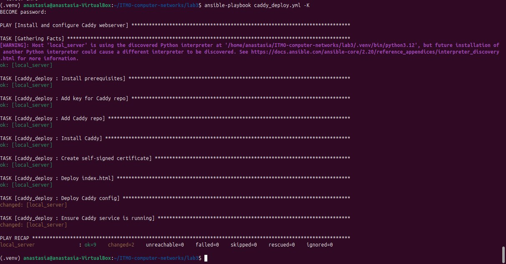

В процессе отладки было выполнено ручное создание сертификатов для проверки корректности конфигурации, после чего генерация была автоматизирована и перенесена в Ansible playbook.

Также был создан html файл для задачи 2a:

```
<!DOCTYPE html>
<html lang="en">
<head>
    <meta charset="UTF-8">
    <title>Hello Caddy</title>
</head>
<body>
    <h1>Hello world from Caddy!</h1>
</body>
</html>
```

После создания html файла и перезапуска caddy проверяем:

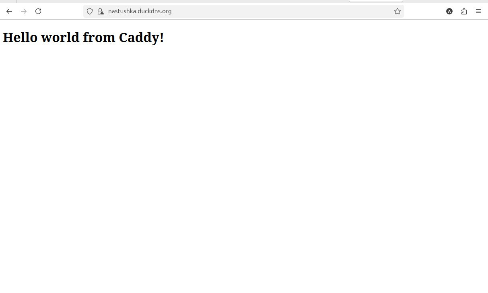

## Вывод:

В ходе выполнения лабораторной работы была выполнена установка и настройка Ansible и веб-сервера Caddy на операционной системе Ubuntu. С помощью Ansible были освоены ad-hoc команды и playbook’и, а также механизм ролей, шаблонов и переменных. Веб-сервер Caddy был автоматически установлен и сконфигурирован через Ansible с использованием шаблона Caddyfile и собственного доменного имени. Работа сервиса была проверена после применения конфигурации и перезагрузки службы. В результате лабораторной работы были получены практические навыки автоматизации администрирования серверов, управления конфигурациями и развертывания веб-сервисов с использованием Ansible.
